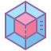
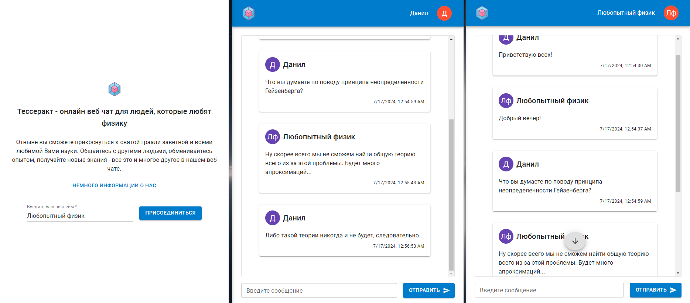
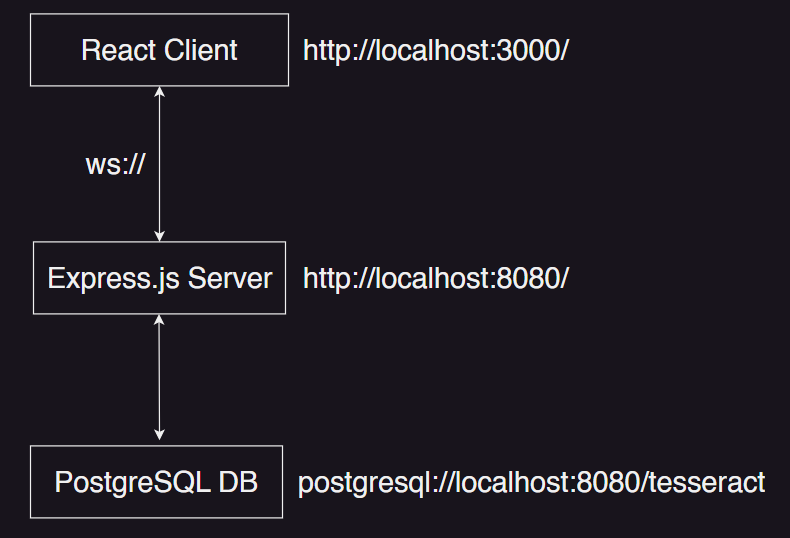

<!-- --------STATS-------- -->
 

<!-- --------LOGO-------- -->
 

	
	
<strong>Тессеракт</strong> - онлайн веб чат для людей, которые любят физику

<!-- --------ABOUT THE PROJECT-------- -->

## О проекте

	

<strong>Тессеракт</strong> - написан с использованием:

<ul>
	<li>Express.js</li>
	<li>PostgreSQL</li>
	<li>WebSockets (ws + react-use-websocket)</li>
	<li>TypeScript</li>
	<li>React (+Router)</li>
	<li>Redux Toolkit</li>
	<li>Material UI</li>
	<li>FSD</li>
</ul>

#### Цель данного веб-сайта

Тессеракт задумывался как простой онлайн чат, где каждый пользователь, задав себе никнейм, может погрузиться в настоящую онлайн комнату физиков, задать интересующие его вопросы по теме и узнать что-то новое.

#### Почему именно такое название?

Название "Тессеракт" было взято из известного и любимого физиками фильма Кристофера Нолана - "Интерстеллар".

Кип Торн, физик-теоретик, ввел в фильм понятие "тессеракт". Это четырехмерный гиперкуб, аналог трехмерного куба в четырехмерном пространстве.

С его помощью главный герой фильма, Купер, наблюдал различные моменты своей жизни по временной оси пространства-времени. Аналогично, веб-чат "Тессеракт" позволяет просматривать различные сообщения участников беседы по временной шкале.

#### Дальнейшее развитие проекта

В будущем данный продукт можно развить на всеобщее использование физиками. Для этого необходимо будет добавить возможность прикрепления медиа-файлов, markdown форматирования. Можно добавить несколько каналов в одном чате, чтобы разделить общую тему физики на несколько узкоспециализированных областей (квантовая физика, классическая механика и пр.). Не стоит забывать и про групповые видео звонки. Также необходимо будет добавить возможность редактирования и удаления сообщений. Кроссплатформенное мобильное приложение повысит охват аудитории, а сбор статистики и правильная интерпретация этих данных позволят сделать продукт еще более удобным и привлекательным к использованию. Но самое главное без чего данное развитие продукта не может быть осуществимо - наличие самих физиков, которые будут помогать в разработке продукта, советовать какие идеи и функции нужны приложению с точки зрения удобства конечных пользователей, а также они будут выполнять функции модератора в чате (удалять нерелевантные или псевдонаучные сообщения, помогать в обсуждении каких-либо проблем и т.д.).

<!-- APP ARCHITECTURE  -->

## Архитектура приложения

	

<!-- SET UP INSTRUCTIONS -->

## Инструкция по запуску приложения

В папке `./frontend` выполните команды `npm i` и `npm run start` для запуска клиента.

В папке `./backend` выполните команды `npm i` и `npm run dev` для запуска сервера.

Также подразумевается наличие PostgreSQL с базой данных _tesseract_ и таблицей _messages_ внутри (SQL скрипт по созданию таблицы лежит по пути `./backend/postgres/messages.sql`).

<!-- --------CONTRIBUTING-------- -->

## Контрибуция

Контрибуция делает сообщество с открытым исходным кодом удивительным местом для обучения, вдохновения и творчества. Любой ваш вклад **высоко ценится.**

Если у вас есть предложение по улучшению, пожалуйста, сделайте fork репозитория и создайте pull request. Вы также можете просто создать issue с меткой "enhancement".
Не забудьте поставить star проекту! Спасибо еще раз!

1. Fork репозиторий
2. Создайте вашу Feature Branch (`git checkout -b feature/AmazingFeature`)
3. Сделайте коммиты с изменениями (`git commit -m 'Add some AmazingFeature'`)
4. Push в ветку (`git push origin feature/AmazingFeature`)
5. Откройте Pull Request

<!-- --------CONTACT-------- -->

## Связь со мной

Очагов Данил

Email: danilochagov@gmail.com

Telegram: @danilochagov

VK: https://vk.com/danilochagov

Ссылка на Github проект: [https://github.com/ochagovdanil/tesseract](https://github.com/ochagovdanil/tesseract)
